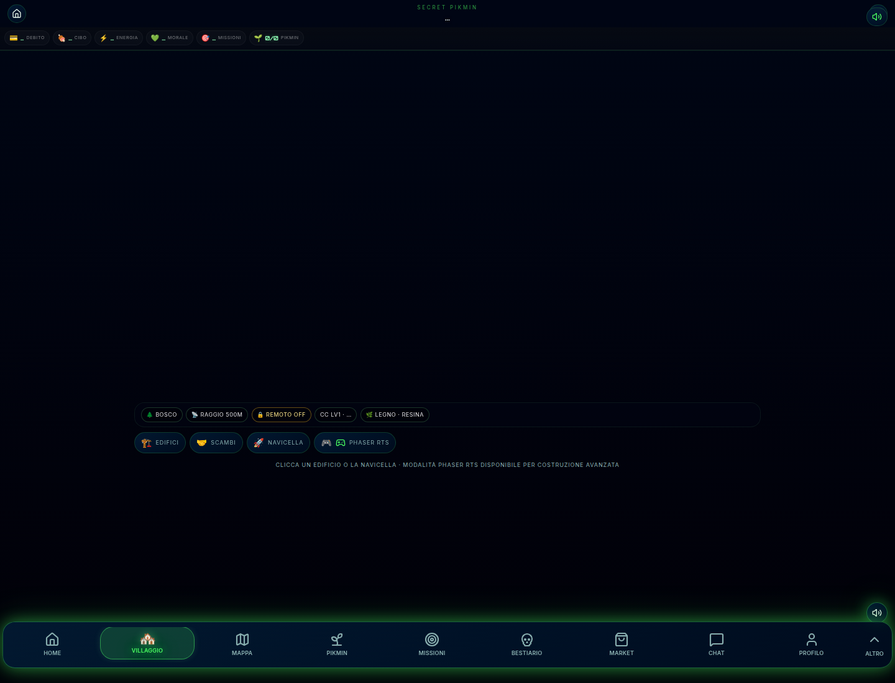

# FASE V1.1 - Villaggio fisico

**Progetto:** Secret Pikmin  
**Data:** 2026-05-30  
**Scope:** solo `/villaggio`, `VillageDiorama`, componenti diorama, CSS villaggio e rappresentazione visiva edifici.

---

## Screenshot



---

## Modifiche effettuate

- Il diorama non mostra piu tutti gli edifici come completi quando arrivano stati legacy (`active`).
- Stato iniziale visuale: capsula/Centro di Controllo, Magazzino provvisorio, Hangar danneggiato, fondamenta per gli altri edifici.
- Layout permanente degli slot:
  - Hangar in alto
  - Laboratorio, Centro, Mercato al centro
  - Magazzino e Accademia in basso
- Terreno trasformato in diorama fisico con prato irregolare, sentieri primitivi, rocce, erba, fiori, sfondo e foreground.
- Aggiunti livelli visivi foreground/midground/background con ombre e profondita.
- Stati visuali supportati per gli edifici:
  - `locked`
  - `buildable`
  - `under_construction`
  - `level_1`
  - `level_2`
  - `level_3`
  - `level_4`
  - `level_5`
- Edifici ancora cliccabili tramite rotte/azioni esistenti.
- HUD e quick action di `/villaggio` resi piu compatti per lasciare il focus al villaggio.

---

## Stato finale

Il villaggio ora comunica una colonia appena fondata: la base e presente, l'Hangar e danneggiato, il Magazzino e provvisorio e gli altri edifici appaiono come aree/fondamenta da costruire nel tempo.

Nessuna nuova tabella, meccanica, missione o integrazione Supabase e stata introdotta.

---

## Verifica

```bash
npm run build
```

**Esito:** OK.

`/villaggio` e stato aperto in Chrome headless per acquisire lo screenshot del report.
