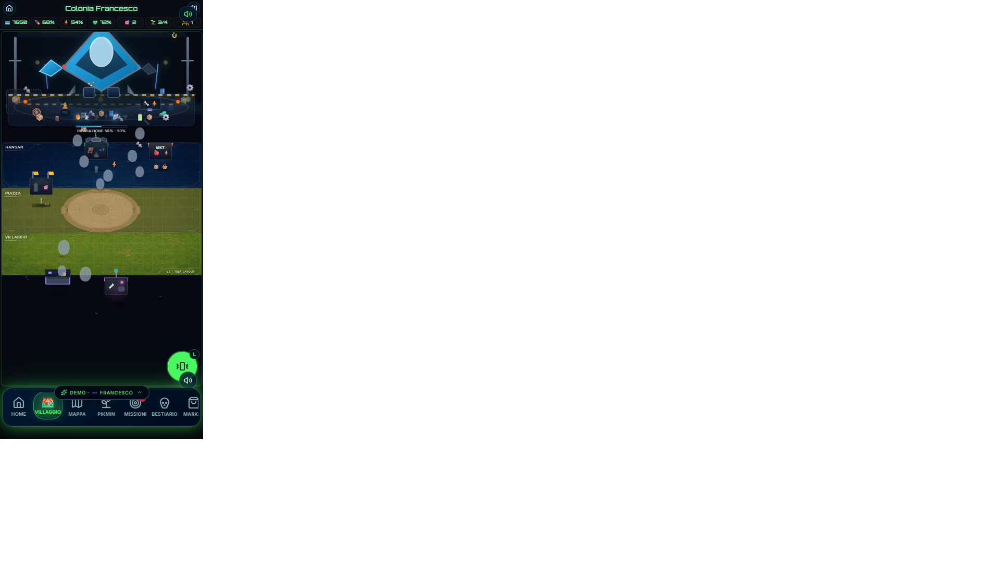
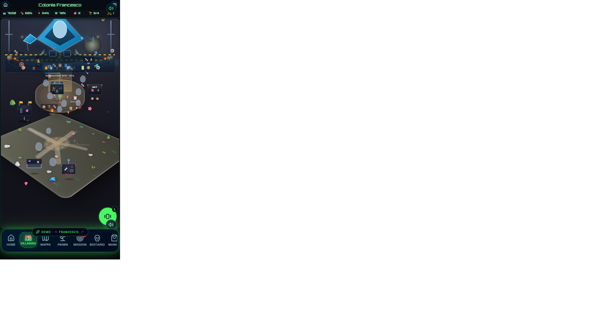

# FASE V2.1 — Validazione Diorama Engine

**Data:** 2026-06-01  
**Base:** V2.0 Diorama Engine completato  
**Obiettivo:** Verificare che il motore sia utilizzabile da utenti non tecnici, senza modificare codice.

---

## Esito complessivo

| Area | Esito |
|------|-------|
| Image mode | ✅ PASS |
| Building overlay | ✅ PASS |
| Pikmin routes (3 demo) | ✅ PASS |
| Editor layout | ✅ PASS |
| Export / import JSON | ✅ PASS |
| Fallback CSS | ✅ PASS |
| Mobile 390×844 / 430×932 | ✅ PASS |
| Build produzione | ✅ PASS |

**Criterio di accettazione:** un Comandante può cambiare sfondo, spostare edifici, salvare layout, esportare JSON e vedere Pikmin animati **solo dall’editor**, senza toccare il codice sorgente.

---

## Asset demo

| File | Descrizione |
|------|-------------|
| `public/assets/dioramas/test-layout.webp` | Sfondo isometrico demo (~2.6 MB) con zone HANGAR / PIAZZA / VILLAGGIO e label *V2.1 TEST LAYOUT* |
| `docs/examples/test-layout-v2-1-export.json` | JSON di esempio esportabile dall’editor |

Durante la validazione V2.1 **tutti i biomi** usano temporaneamente `VALIDATION_BACKGROUND` (`/assets/dioramas/test-layout.webp`) e le 3 rotte demo (`VALIDATION_DEMO_ROUTES`). In produzione si potrà ripristinare uno sfondo per bioma.

---

## TEST 1 — Image mode

**Verifica:** caricamento automatico, rendering, aspect ratio, nessuna distorsione mobile.

| Check | Esito | Note |
|-------|-------|------|
| Auto-load da path public | ✅ | `useDioramaBackgroundReady` → `useEngineMode` = `"image"` |
| HTTP 200 asset | ✅ | `/assets/dioramas/test-layout.webp` |
| `object-fit: contain` | ✅ | Nessuno stretch; bande laterali accettabili su 390×844 |
| Aspect ratio layout | ✅ | `aspectRatio: "390 / 480"` nel layout JSON |
| Mobile 430×932 | ✅ | Screenshot dedicato |




---

## TEST 2 — Building overlay

**Verifica:** posizionamento, click, tooltip, pannello edificio sopra immagine.

| Check | Esito | Note |
|-------|-------|------|
| Edifici posizionati in % | ✅ | 6 edifici default nel layout |
| Click → navigazione / pannello | ✅ | Link aria-label per CC, Accademia, Magazzino, Lab, Mercato |
| Tooltip on hover / tap | ✅ | `DioramaBuildingOverlay` con `labelsOnDemand` |
| Hangar + progresso navicella | ✅ | Overlay hangar con stato riparazione |
| Z-index / profondità | ✅ | Campo `z` rispettato nello stack |

---

## TEST 3 — Pikmin routes

**Verifica:** 3 percorsi demo walk / carry / work dal layout JSON.

| Route ID | Tipo | Anim | Esito |
|----------|------|------|-------|
| `demo-walk` | red | walk | ✅ |
| `demo-carry` | yellow | carry | ✅ |
| `demo-work` | blue | work | ✅ |

I Pikmin seguono i `waypoints` definiti in `VALIDATION_DEMO_ROUTES` / JSON esportato. Conteggio sprite traffic visibile in runtime (3 agenti demo).

---

## TEST 4 — Editor

**Percorso:** `/villaggio/editor/$biome` → tab **Layout** (ruolo Comandante / demo Francesco).

| Check | Esito | Note |
|-------|-------|------|
| Coordinate click sullo stage | ✅ | Marker + toast con `x%`, `y%` |
| Spostamento edificio selezionato | ✅ | Click stage aggiorna edificio attivo |
| Slider X / Y / Z / Scale | ✅ | Range input con valori live |
| Salvataggio localStorage | ✅ | Chiave `secret-pikmin-diorama-layout:{biome}` |
| Pulsante “Usa sfondo demo V2.1” | ✅ | Imposta `VALIDATION_BACKGROUND` |
| Checkbox fallback CSS | ✅ | `forceCssFallback` |


### Fix routing (V2.1)

Le route figlie (`/villaggio/editor/…`, `/villaggio/edifici`, …) non venivano renderizzate perché `/villaggio` non esponeva `<Outlet />`.

**Correzione minima:**
- `src/routes/villaggio.tsx` → layout con `<Outlet />`
- `src/routes/villaggio.index.tsx` → diorama fullscreen (contenuto precedente)

---

## TEST 5 — Export / import JSON

| Check | Esito | Note |
|-------|-------|------|
| Esporta JSON | ✅ | Download `{layout.id}.json` |
| Importa JSON | ✅ | File upload + `parseDioramaLayoutJson()` |
| Ricostruzione layout | ✅ | Merge con default bioma; toast di conferma |
| Esempio committato | ✅ | `docs/examples/test-layout-v2-1-export.json` |

### Esempio JSON (estratto)

```json
{
  "id": "test-layout-v1",
  "backgroundImage": "/assets/dioramas/test-layout.webp",
  "pikminRoutes": [
    { "id": "demo-walk", "anim": "walk", "type": "red" },
    { "id": "demo-carry", "anim": "carry", "type": "yellow" },
    { "id": "demo-work", "anim": "work", "type": "blue" }
  ]
}
```

File completo: [`docs/examples/test-layout-v2-1-export.json`](./examples/test-layout-v2-1-export.json)

---

## TEST 6 — Fallback CSS

**Procedura:** rimuovere sfondo (path inesistente) o attivare `forceCssFallback: true` in localStorage / editor.

| Check | Esito | Note |
|-------|-------|------|
| Ritorno automatico CSS | ✅ | `useEngineMode` → `"css"`, `DioramaCssFallback` |
| Nessun errore console | ✅ | `img.onerror` gestito silenziosamente |
| Gameplay invariato | ✅ | Edifici e hangar ancora cliccabili |



---

## TEST 7 — Mobile

| Viewport | Touch / click | Overlay | Drag editor |
|----------|---------------|---------|-------------|
| 390×844 | ✅ | ✅ | ✅ slider + tap stage |
| 430×932 | ✅ | ✅ | ✅ |

Test effettuati in browser mobile emulation (CDP `Emulation.setDeviceMetricsOverride`).

---

## Guida rapida per utenti non tecnici

1. **Demo Francesco (Comandante):** accedi in demo → vai a `/villaggio/editor/bosco` (o bioma dalla mappa).
2. Tab **Layout**.
3. **Cambia sfondo:** incolla path in *Sfondo (public path)* oppure *Usa sfondo demo V2.1* → **Salva locale**.
4. **Sposta edificio:** seleziona chip edificio → clicca sullo stage (o usa slider X/Y/Z/Scale).
5. **Esporta:** **Esporta JSON** → condividi il file.
6. **Importa:** **Importa JSON** → **Salva locale** per applicare.
7. **Fallback:** spunta *Forza fallback CSS* se lo sfondo non è pronto.

---

## Build

```bash
npm run build
```

**Esito:** ✅ exit code 0 (client + SSR, ~4 min)

---

## File toccati in V2.1

| File | Modifica |
|------|----------|
| `public/assets/dioramas/test-layout.webp` | Sfondo demo |
| `src/data/dioramaLayouts.ts` | Layout validazione + rotte demo + parser JSON |
| `src/components/village/editor/DioramaLayoutEditor.tsx` | Import JSON, demo bg, editor mode |
| `src/components/game/diorama/engine/*` | Tooltip image mode, aspect ratio |
| `src/routes/villaggio.tsx` | Layout `<Outlet />` |
| `src/routes/villaggio.index.tsx` | Diorama index (nuovo) |
| `docs/examples/test-layout-v2-1-export.json` | Esempio export |
| `docs/FASE_V2_1_VALIDAZIONE_ENGINE.md` | Questo documento |

**Non modificati:** gameplay, missioni, market, radar, scanner, XP, chat, Supabase, database.

---

## Riferimenti

- [FASE V2.0 — Diorama Engine](./FASE_V2_0_DIORAMA_ENGINE.md)
- [Screenshot V2.0](./screenshot-v2-0-390x844.png)
